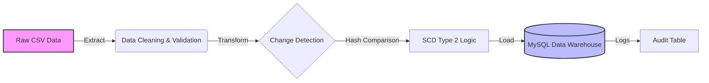
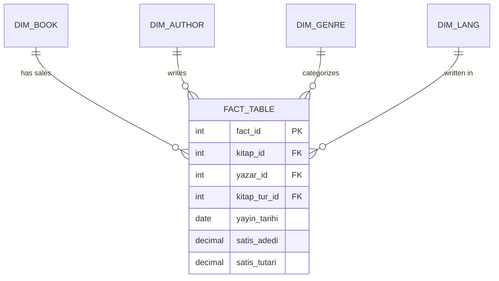

# 📚 Book Analytics ETL Pipeline


> **A production-grade ETL pipeline designed for robust data ingestion, historical tracking (SCD Type 2), and analytics-ready modeling.**

---

## 📖 Table of Contents
- [📍 Overview](#-overview)
- [🏗 System Architecture](#-system-architecture)
- [🗂 Data Model (Star Schema)](#-data-model-star-schema)
- [⚡ Key Features](#-key-features)
- [🛠 Installation & Setup](#-installation--setup)
- [📊 Logging & Observability](#-logging--observability)
- [🔮 Future Roadmap](#-future-roadmap)

---

## 📍 Overview

This project implements a modular **Data Engineering Pipeline** that ingests raw book sales data, cleanses localized formatting, and loads it into a **MySQL Data Warehouse**.

Unlike simple data migration scripts, this solution focuses on **Data Quality** and **Historical Fidelity**. It employs a **Slowly Changing Dimension (SCD) Type 2** strategy to track changes in dimension attributes (e.g., book prices, authors) over time, ensuring accurate historical reporting.

---

## 🏗 System Architecture

The pipeline follows a strict **Extract-Load-Transform (ELT/ETL)** pattern with a "Fail-Fast" validation mechanism.



---

## 🗂 Data Model (Star Schema)

The database is designed using a **Star Schema** approach to optimize analytical queries.



* **Fact Table:** Stores transactional metrics (`sales_amount`, `quantity`) at the granularity of *Book + Date*.
* **Dimension Tables:** Store descriptive attributes with SCD tracking enabled.

---

## ⚡ Key Features

### 🛡️ 1. robust Data Validation

The pipeline enforces strict data quality rules before loading:

* **Schema Validation:** Ensures all required columns exist.
* **Type Enforcement:** Converts `15.08.2019` to `YYYY-MM-DD` and cleans numeric formats (e.g., `2.207,50` → `2207.50`).
* **Business Logic:** Rejects records with negative sales or missing business keys.

### 🕰️ 2. Slowly Changing Dimension (Type 2)

We handle data evolution without losing history:

* **Mechanism:** SHA-256 Hashing.
* **Logic:** A hash is generated for every row based on tracked attributes. If the hash differs from the database record, the old record is "retired" (`is_active=0`, `end_date=NOW()`) and a new record is inserted.

### 🔍 3. Idempotency

The pipeline is designed to be idempotent. Running the pipeline multiple times on the same dataset will not result in duplicate records.

---

## 🛠 Installation & Setup

### Prerequisites

* Python 3.8+
* MySQL Server 8.0+

### Steps

1. **Clone the Repository**
```bash
git clone [https://github.com/yourusername/book-analytics-etl.git](https://github.com/yourusername/book-analytics-etl.git)
cd book-analytics-etl

```


2. **Install Dependencies**
```bash
pip install -r requirements.txt

```


3. **Configuration**
Edit `config/db_config.yaml` with your database credentials:
```yaml
database:
  host: "localhost"
  user: "root"
  password: "yourpassword"
  schema: "book_analytics_db"

```


4. **Run the Pipeline**
```bash
python main.py

```


---

## 📊 Logging & Observability

Every execution is logged to the `etl_logs` table for full auditability.

| Log Field | Description |
| --- | --- |
| `run_id` | Unique UUID for the execution batch |
| `status` | `SUCCESS` or `FAILED` |
| `duration_sec` | Execution time for performance monitoring |
| `scd_inserts` | Number of new history records created |
| `error_msg` | Detailed stack trace in case of failure |

---

## 📂 Project Structure

```text
.
├── config/              # Configuration files (YAML)
├── data/                # Raw CSV input files
├── src/
│   ├── extract.py       # Data ingestion & cleaning
│   ├── transform.py     # Business logic & SCD preparation
│   ├── load.py          # Database operations
│   └── validation.py    # Quality checks
├── logs/                # Local log files
├── main.py              # Application entry point
├── requirements.txt     # Python dependencies
└── README.md            # Documentation

```

---

## 🔮 Future Roadmap

* [ ] **Containerization:** Dockerize the application for easier deployment.
* [ ] **Orchestration:** Migrate scheduling to Apache Airflow.
* [ ] **Visualization:** Connect a Metabase or Superset dashboard to the MySQL Warehouse.
* [ ] **Testing:** Add PyTest unit tests for transformation logic.

---

<p align="center">
<sub>Built with ❤️ by Ferhat using Python & SQL.</sub>
</p>

```

```
